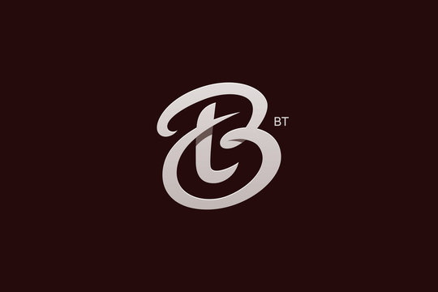

# 🚀 Bonam Tarun - Portfolio Website

<div align="center">



**A modern, interactive portfolio showcasing AI/ML projects, data analytics work, and cybersecurity solutions**

[](https://bonamtarun.github.io/portfolio)
[](LICENSE)

</div>

---

## 👨‍💻 About Me

I'm **Bonam Tarun**, a passionate **AI & Data Analyst** and **Google Student Ambassador** pursuing B.Tech in Computer Science Engineering. I specialize in building intelligent solutions using Machine Learning, Data Analytics, and Cybersecurity technologies.

🎯 **Current Focus:** AI/ML Development | Data Analytics | Cybersecurity  
🏆 **Role:** Google Student Ambassador  
📍 **Location:** India

---

## ✨ Features

- 🎨 **Modern UI/UX** - Glassmorphism design with smooth animations
- 🌙 **Dark Theme** - Eye-friendly dark mode with custom color scheme
- 📱 **Fully Responsive** - Optimized for all devices (mobile, tablet, desktop)
- 🎭 **3D Animations** - Interactive Three.js background effects
- 💼 **Project Showcase** - Featured projects with live demos and videos
- 📊 **Skills Visualization** - Interactive skill cards with categories
- 📧 **Contact Form** - Integrated EmailJS for direct messaging
- 🎓 **Certifications** - Showcase of achievements and awards
- ⚡ **Performance Optimized** - Fast loading with lazy-loaded images

---

## 🛠️ Tech Stack

### Frontend
- **HTML5** - Semantic markup
- **CSS3** - Custom animations & glassmorphism effects
- **JavaScript (ES6+)** - Interactive functionality
- **Tailwind CSS** - Utility-first styling
- **Three.js** - 3D graphics and animations

### Libraries & Tools
- **Font Awesome** - Icon library
- **Remix Icons** - Additional icon set
- **Google Fonts** - Custom typography (Pacifico)
- **EmailJS** - Contact form integration

### Features
- Intersection Observer API for scroll animations
- Responsive design with mobile-first approach
- SEO optimized with meta tags
- Lazy loading for images and videos

---

## 🎨 Color Palette

| Color | Hex | Usage |
|-------|-----|-------|
| Primary Red | `#780606` | Accents, buttons, highlights |
| Dark Background | `#1a1a1a` | Main background |
| Glass Effect | `rgba(26, 26, 26, 0.4)` | Card backgrounds |
| Pink Accent | `#ff9ecd` | Gradients, hover effects |

---

## 📂 Project Structure

```
BT Portfolio/
├── index.html              # Main HTML file
├── BTLOGO.jpg             # Logo/favicon
├── profile photo.jpg      # Profile image
├── resume.pdf             # Downloadable resume
├── favicon.png            # Browser favicon
│
├── Project Assets/
│   ├── phishingurldetector.jpg
│   ├── smart ai mate.jpg
│   ├── powerbi.jpg
│   ├── vim.jpg
│   ├── iot.png
│   ├── dashboard.mp4
│   ├── phishing.mp4
│   └── samaivoice.mp4
│
└── Icons/
    ├── codechef.png
    └── codec.png
```

---

## 🚀 Quick Start

### 1. Clone the Repository

```bash
git clone https://github.com/bonamtarun/portfolio.git
cd portfolio
```

### 2. Open Locally

Simply open `index.html` in your browser:

```bash
# Windows
start index.html

# macOS
open index.html

# Linux
xdg-open index.html
```

### 3. Deploy to GitHub Pages

1. Push your code to GitHub
2. Go to **Settings** → **Pages**
3. Select `main` branch as source
4. Your site will be live at `https://your-username.github.io/portfolio`

---

## 📧 Contact Form Setup

The contact form uses **EmailJS**. To set it up:

1. Create an account at [EmailJS](https://www.emailjs.com/)
2. Create an email service and template
3. Update the following in `index.html`:

```javascript
emailjs.init('YOUR_PUBLIC_KEY');

emailjs.send(
    'YOUR_SERVICE_ID',
    'YOUR_TEMPLATE_ID',
    // ... template params
);
```

---

## 🎯 Sections

| Section | Description |
|---------|-------------|
| **Hero** | Introduction with animated background |
| **About** | Personal info, education, and interests |
| **Skills** | Technical skills organized by category |
| **Projects** | Featured projects with demos and descriptions |
| **Experience** | Work experience timeline |
| **Certifications** | Awards and certifications |
| **Contact** | Contact form and social links |

---

## 🌟 Featured Projects

### 1. **ML-Based Vulnerability Scanner**
Advanced cybersecurity tool using machine learning to detect code vulnerabilities.
- **Tech:** Python, Machine Learning, Flask
- **Features:** Real-time scanning, vulnerability detection

### 2. **Phishing URL Detector**
AI-powered tool to identify malicious URLs and protect users from phishing attacks.
- **Tech:** Python, NLP, Machine Learning
- **Features:** URL analysis, threat detection

### 3. **Smart AI Mate**
Intelligent voice assistant with natural language processing capabilities.
- **Tech:** Python, NLP, Speech Recognition
- **Features:** Voice commands, task automation

### 4. **Power BI Dashboard**
Interactive data visualization dashboard for business analytics.
- **Tech:** Power BI, DAX, Data Modeling
- **Features:** Real-time analytics, custom visuals

### 5. **IoT Smart Home System**
Connected home automation system with sensor integration.
- **Tech:** IoT, Arduino, Python
- **Features:** Remote control, automation

---

## 📱 Responsive Design

The portfolio is fully responsive across all devices:

- 📱 **Mobile** (320px - 767px)
- 📱 **Tablet** (768px - 1023px)
- 💻 **Desktop** (1024px+)

---

## ⚡ Performance

- ✅ Lazy loading for images and videos
- ✅ Optimized animations with CSS transforms
- ✅ Minimal JavaScript for faster load times
- ✅ CDN-hosted libraries for better caching
- ✅ Preloaded critical assets

---

## 🔧 Customization

### Update Personal Information

Edit the following sections in `index.html`:

1. **Meta Tags** (Lines 11-32) - Update SEO information
2. **Hero Section** - Change name, title, description
3. **About Section** - Update bio and education
4. **Projects** - Add/remove projects
5. **Contact Info** - Update email and social links

### Change Colors

Modify the Tailwind config (Lines 49-70):

```javascript
tailwind.config = {
    theme: {
        extend: {
            colors: {
                primary: '#780606',  // Change primary color
                secondary: '#1a1a1a' // Change secondary color
            }
        }
    }
}
```

---

## 📄 License

This project is licensed under the **MIT License** - feel free to use it for your own portfolio!

---

## 🤝 Connect With Me

<div align="center">

[](https://www.linkedin.com/in/bonam-tarun-5918b3287/)
[](https://github.com/bonamtarun)
[](mailto:bonam.tarun@gmail.com)
[](https://bonamtarun.github.io/portfolio)

</div>

---

## 🙏 Acknowledgments

- **Three.js** - 3D graphics library
- **Tailwind CSS** - Utility-first CSS framework
- **EmailJS** - Email service integration
- **Font Awesome & Remix Icons** - Icon libraries
- **Google Fonts** - Typography

---

## 📊 Stats


---

<div align="center">

**⭐ Star this repo if you found it helpful!**

Made with ❤️ by [Bonam Tarun](https://github.com/bonamtarun)

</div>
